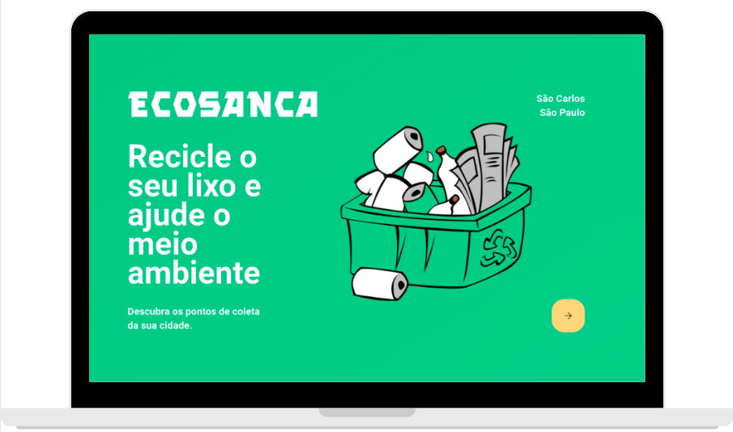

<h1 align="center">Projeto "Ecosanca".</h1>

  <a href="#-about">Sobre</a>&nbsp;&nbsp;&nbsp;|&nbsp;&nbsp;&nbsp;
  <a href="#-technologies">Tecnologias</a>&nbsp;&nbsp;&nbsp;|&nbsp;&nbsp;&nbsp;
  <a href="#-projet">Projeto</a>&nbsp;&nbsp;&nbsp;|&nbsp;&nbsp;&nbsp;
  <a href="#memo-license">License</a>

  

<h2 align="center">About 📖</h2>
   
   

      The Happy project, developed during the Next Level Week, from <a href="https://rocketseat.com.br/">Rocketseat</a>, from the 12th to the 18th of October. 
      The project is inspired by Charities, which carry out very important work in the world. And it is intended to encourage children to visit orphanages, which is a beautiful thing to see the happiness of children. 
      And the challenge for the week was to propose not only programming, but also a little reflection. 😀 
      Let's bring happiness to the world! 😊  
      This event had a lot of exclusive, free content, it was simply sensational and profitable! 😄
   

   - ✅ "Accelerating Your Evolution" 💪
   - ✅ "Looking at opportunities" 👀
   - ✅ "The Stack's Choice" 📌
   - ✅ "Up to two years in 2 months" 🔥
   - ✅ "The extra mile" 🚀
   
## Visualizando a aplicação

  
  
  ## Cadastrando um Ecoponto
  
  

 

## 🚀 Tecnologias

Esse projeto foi desenvolvido com as seguintes tecnologias:

- [Node.js](https://nodejs.org/en/)
- [React](https://reactjs.org)
- [TypeScript](https://www.typescriptlang.org/)

## 💻 Projeto

O Ecosanca é uma aplicação que conecta pessoas à casas de acolhimento institucional para fazer o dia de muitas crianças mais feliz 💜

## :memo: Licença

Esse projeto está sob a licença MIT. Veja o arquivo [LICENSE](LICENSE.md) para mais detalhes.

---

Feito com ♥ by Kemuel Batista
